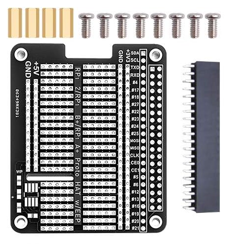

# Charlie – Raspberry Pi 4 Hardware Connection Specification

This document defines the **hardware connectivity requirements** for Charlie
when using a Raspberry Pi 4 together with a Proto HAT–style expansion board.

The focus is on **physical connections, serviceability, and future expansion**.
Electrical characteristics, pin numbers, and firmware behavior are out of scope.

---

## Reference HAT Board

The **GeeekPi Prototype Breakout DIY Breadboard** HAT is used as the **reference hardware** for this specification.

Any alternative HAT must provide **functionally equivalent capabilities**.

---

## 1. Scope and Principles

This specification defines:
- Internal connections between Raspberry Pi 4 and HAT
- External connectors exposed by the HAT

Design principles:
- Removability
- Observability
- Serviceability
- Minimal permanent modification
- Future-proof expansion

---

## 2. Internal Connections (Raspberry Pi ↔ HAT)

### 2.1 HAT Mounting

- The board shall mount as a **standard Raspberry Pi HAT** using the 40-pin GPIO header.
- Mechanical mounting using spacers and screws is required.
- The Raspberry Pi must remain removable.

---

### 2.2 RUN / Reset Line Extension

- The Raspberry Pi **RUN (reset) line** shall be routed to the HAT as a **single wire connection**.
- The connection must **not be permanently soldered at both ends**.
- At least **one connector** must exist in the RUN line path.
- A single soldered connection on the Raspberry Pi PCB is permitted, as the RUN line is not exposed on a header.
- The HAT must be removable **without any desoldering**.

Purpose:
- Enable system-level reset control
- Support external reset input

---

### 2.3 Watchdog GPIO Loopback

- Two GPIO pins are reserved for a **hardware watchdog loop**:
  - One GPIO configured as output
  - One GPIO configured as input
- These two pins shall be **directly looped together on the HAT**.

Purpose:
- Output pin toggled periodically by software
- Input pin monitors expected transitions

---

### 2.4 Watchdog Activity LED

- A visible LED shall be mounted on the HAT board connected to the watchdog output GPIO.
- The LED shall reflect logic-level changes on the watchdog signal.
- The LED is for **human observability only**.

Electrical implementation details are not prescribed.

---

## 3. External Connections

### 3.1 External Reset Button Connector

- Provide a **2-pin connector** for an external reset button.
- This connector shall be **electrically connected to the Raspberry Pi RUN (reset) line** described in §2.2.
- Activating the connector shall trigger a Raspberry Pi reset.
- The connector shall expose the following lines:
  - RUN (reset) line
  - GND 

Purpose:
- Manual reset without enclosure disassembly

---

### 3.2 External I²C Device Connectors

- Provide **at least 2**, and **up to 4**, external I²C connectors.
- All connectors shall share the **same I²C bus**.
- Each I²C connector shall expose the following lines:
  - SDA (data)
  - SCL (clock)
  - GND (ground)
  - Power (3.3 V preferred; 5 V optional)

Purpose:
- Connection of external sensors and peripherals

---

### 3.3 General-Purpose GPIO Expansion

- Provide **at least 2**, and **up to 4**, GPIO expansion connectors.
- These connectors are reserved for **undefined future peripherals**.

Two connector layouts are preferred.

#### Option A – Minimal GPIO Connector (2-pin)

- GPIO signal
- GND

#### Option B – Extended GPIO Connector (4-pin, preferred)

- GPIO signal
- GND
- 3.3 V
- 5 V

- A **mix of Option A and Option B connectors is preferred**.
- Alternatively, a GPIO expansion may be implemented using **two adjacent connectors per GPIO line**:
  - one 2-pin connector (GPIO + GND)
  - one 2-pin connector providing power
- Pin ordering is implementation-defined but must be **consistent across all GPIO connectors**.
- GPIO connectors must not assume any predefined function at this stage.

Purpose:
- Future digital I/O expansion

---

### 3.4 UART Expansion Connector (optional)

- Provide one optional UART expansion connector.
- The connector shall expose UART0:
  - TX
  - RX
  - GND
  - 3.3 V

Purpose:
- Debug console access
- Diagnostic and recovery interface

---

### 3.5 SPI Expansion Connector (optional)

- Provide one optional SPI expansion connector.
- The connector shall expose SPI0:
  - MOSI
  - MISO
  - SCK
  - CS0
  - GND

Purpose:
- High-speed peripheral communication

---

## 4. Connector Requirements

- Connectors shall be:
  - Secure against accidental disconnection
  - Hand-connectable and hand-disconnectable
  - Usable without special tools

Recommended connector family:
- **JST-XH (2.54 mm)**
- All external connectors should use the same connector family where practical

---

## 5. Non-Goals

This document does not define:
- Electrical limits or protection circuitry
- Pull-ups, resistors, or level shifting
- Device-specific wiring
