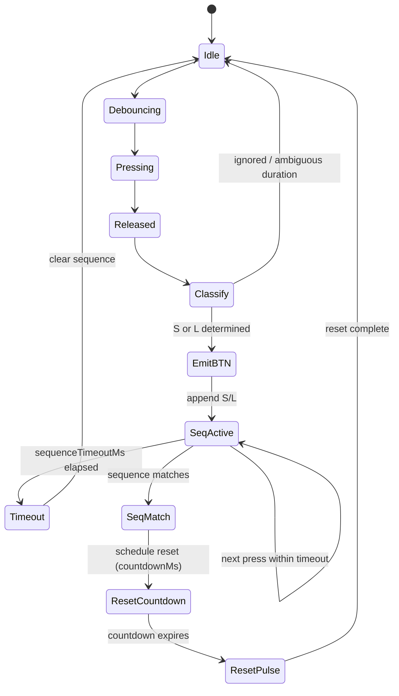
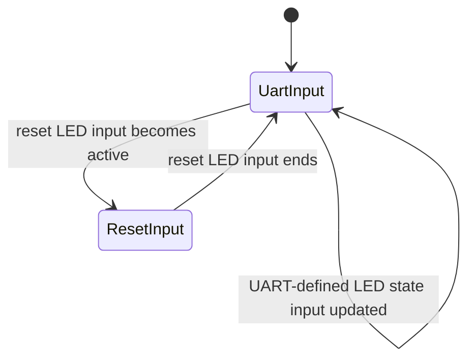

# PicoResetPixel — Specification

This document defines the **UART grammar**, **internal module interfaces**, and **firmware behavior** for PicoResetPixel.

It reflects the final agreed design:

- UART is an **intent + telemetry channel**, not a request/response protocol
- LED control is only **[UART] → [device]**, fire-and-forget
- Button/reset telemetry is only **[device] → [UART]**, fire-and-forget
- Reset authority is fully local to the RP2040
- LED feedback for reset is rendered locally and must not affect reset correctness
- The only request/response interaction is `PING → PONG` at the UART transport level

This document supersedes all earlier drafts.

---

## Definitions

- **Host**: Raspberry Pi 4 running Debian and a Node.js application
- **Device**: PicoResetPixel (RP2040-based)
- **UART**: USB CDC serial interface exposed by the RP2040
- **S / L**: Short / Long button press classifications

---

## Firmware architecture

The firmware is composed of the following modules:

- **UARTTransport**
- **LEDModule** (merged LEDController + LEDDriver)
- **ResetController**

### Dependency rules

- **UARTTransport**
  - owns the USB CDC UART
  - may exist independently of all other modules

- **LEDModule**
  - owns the WS2812 GPIO
  - owns LED timing, sequencing, and output arbitration
  - does not depend on UARTTransport
  - may receive UART-defined LED intent when UARTTransport is present
  - must never emit responses to LED commands

- **ResetController**
  - owns button input and reset logic
  - must compile and operate correctly without:
    - UARTTransport
    - LEDModule
    - emits UART telemetry via UARTTransport (fire-and-forget), when UARTTransport is present  
    - emits reset LED intent to LEDModule (fire-and-forget), when LEDModule is present
  - absence or failure of any other module must not affect reset behavior

---

## UARTTransport

### Responsibilities

UARTTransport must:

- initialize and own the USB CDC UART
- frame incoming bytes into complete UART lines
- perform minimal command discrimination required for routing:
  - dispatch LED-related commands to LEDModule when present
  - handle `PING` internally
- respond to `PING` with `PONG`
- provide a non-blocking `sendLine(line)` API
- serialize TX writes (no interleaving)
- drop TX lines if buffers are full

UARTTransport must not:

- interpret application-level LED or reset behavior
- block reset actions waiting for TX
- expose raw UART lines to other modules
- crash or reset on malformed input

### Framing

- Encoding: ASCII (UTF-8 subset)
- Line delimiter: `\n` (accept `\r\n`)
- Max line length: 128 bytes (excluding delimiter)
- Overlong lines are discarded until next delimiter

---

## UART grammar

UART is **line-based**.  
One line equals one message.

### Summary (all messages)

#### UART → Device (fire-and-forget, no responses)

```
LED <r> <g> <b> <br>
LED OFF
```

#### Device → UART (ResetController telemetry, fire-and-forget)

```
BTN S
BTN L
RESET SCHEDULED <countdownMs>
RESET TRIGGERED
```

#### Transport health check

```
PING
→ PONG
```

No other responses exist.

---

## Command semantics

### `PING`

UART transport health check.

- Handled by UARTTransport
- Must respond with `PONG` regardless of module presence
- Exists solely for diagnostics and testing

---

### `LED <r> <g> <b> <br>`

Set LED color and brightness.

- `r,g,b,br ∈ [0..255]`
- Fire-and-forget
- No acknowledgment
- If LEDModule is absent, the command is silently ignored

---

### `LED OFF`

Turn LED off.

- Equivalent to `LED 0 0 0 0`
- Fire-and-forget
- No acknowledgment

---

## Internal interfaces

This section defines the minimal internal interfaces between firmware modules.

All interfaces are:
- one-way
- fire-and-forget
- non-blocking

---

## UARTTransport → LEDModule interface

UARTTransport translates UART LED commands into **UART-defined LED intent**.

### API (conceptual)

```
led.setUartState({
  r: number,
  g: number,
  b: number,
  brightness: number
})
```

Rules:
- Calls are fire-and-forget
- If LEDModule is absent, calls are ignored

---

## ResetController → LEDModule interface

ResetController emits **reset LED intent** to LEDModule.

ResetController must:
- emit intent only (not animation steps)
- never wait for LED availability
- never block reset timing

### Reset LED intents

Minimum required intents:

- `PRESS_S`
- `PRESS_L`
- `SEQ_MATCH`
- `SEQ_TIMEOUT`
- `RESET_SCHEDULED { countdownMs }`
- `RESET_TRIGGERED`

### API (conceptual)

```
led.notifyResetIntent(type, payload?)
```

Rules:
- Calls are fire-and-forget
- If LEDModule is absent, calls are ignored

---

## LEDModule behavior

LEDModule is the **only module that directly drives the WS2812 GPIO**.

1. **UART-defined LED state input**
  - provided by UARTTransport
  - updated by `led.setUartState(...)`

2. **Reset LED intent input**
  - provided by ResetController
  - delivered via `led.notifyResetIntent(...)`

### Responsibilities

LEDModule must:

- maintain the latest UART-defined LED state
- render reset LED feedback when reset intent is active
- give reset LED feedback priority over UART-defined LED state
- continue accepting UART-defined LED updates during reset feedback
- restore the latest UART-defined LED state when reset feedback ends

LEDModule owns:
- all LED timing
- all LED sequencing for reset feedback
- arbitration between UART-defined LED state and reset LED intent

If LEDModule is absent:
- UART-defined LED state updates are ignored
- reset LED intent is ignored
- reset behavior remains fully correct

---

## Reset LED feedback responsibility

Reset LED feedback is split by responsibility:

- **ResetController** defines *when* reset-related feedback should occur
- **LEDModule** defines *how* that feedback is rendered over time

ResetController must:
- emit reset LED intent only
- never perform LED timing, sequencing, or animation
- never block or delay reset logic for LED feedback

The host never commands LED animations.

---

## ResetController behavior

ResetController owns:

- button GPIO input
- RUN / Enable GPIO output
- all timing and sequence logic

It must function correctly without UARTTransport or LEDModule.

### Timing parameters (firmware constants)

- `debounceMs` (default: 50)
- `shortMaxMs` (default: 350)
- `longMinMs` (default: 700)
- `sequenceTimeoutMs` (default: 2000)
- `resetPulseMs` (default: 150)
- `countdownMs` (default: firmware-defined, may be 0)

`countdownMs = 0` means immediate reset.

---

## Reset sequence behavior

- Button edges are debounced
- Stable press duration is classified as `S` or `L`
- After classification:
  - emit `BTN S` or `BTN L` over UART (fire-and-forget, if UARTTransport is present)
  - append classification to the sequence buffer
- Sequence buffer resets on timeout
- When the configured sequence matches:
  - emit `RESET SCHEDULED <countdownMs>` (fire-and-forget)
  - schedule reset after `countdownMs`
- At countdown expiry:
  - emit `RESET TRIGGERED` (fire-and-forget)
  - assert RUN line low for `resetPulseMs`

Reset must not wait for UART or LED feedback.

---

## ResetController state machine



---

## LEDModule state machine



---

## UART ordering and robustness

- TX is serialized FIFO
- No module writes directly to the UART peripheral
- TX drops are allowed under pressure
- RX must tolerate malformed input and framing errors

---

## Test matrix (minimum)

### Reset-only build
- Button S/L classification
- Sequence matching
- Countdown (`0` and non-zero)
- RUN pulse correctness
- No UART or LED dependency

### LED-only build
- `PING → PONG`
- LED commands update LED output

### Full build
- Button telemetry emitted
- Reset scheduling and execution
- Reset LED feedback rendered and restored
- Reset unaffected by UART or LED failures

---

## Implementation notes

- Prefer fixed-size buffers
- Keep parsing strict and minimal
- Treat UART as intent + telemetry, not control
- Reset path must be electrically and logically independent

---
