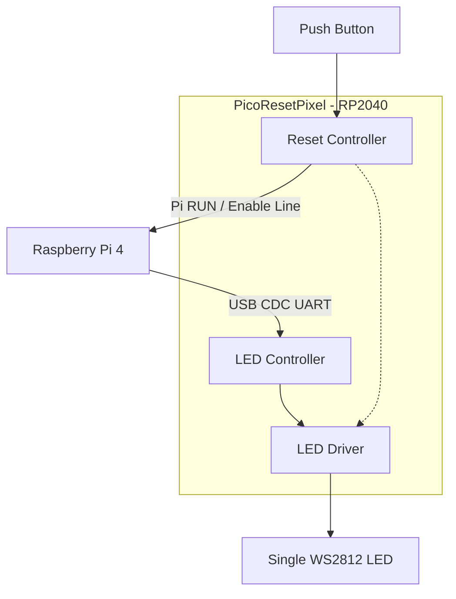
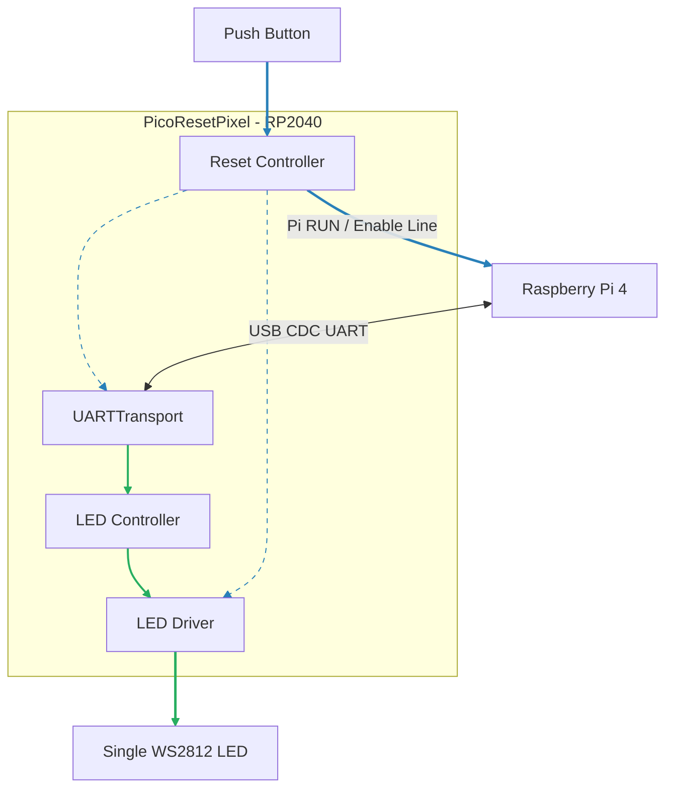

# PicoResetPixel — Scope Agreement

This document defines the **agreed scope** for the PicoResetPixel device before writing the full specification.

PicoResetPixel is an **RP2040-based hardware + firmware device** that provides:
- **LED control** for a single WS2812 LED, driven by a Raspberry Pi 4 over UART
- **Reset control** for a Raspberry Pi 4, capable of performing a hard reset

(Alternative reset mechanisms such as full power-cycle are considered later and are not part of the core scope here.)

---

## Conceptual system placement

PicoResetPixel is an **external supervisory device** for a target host.

### Target host
- Raspberry Pi 4
- Runs Debian and a Node.js application
- May become unresponsive, unreachable, or powered off

---

## Conceptual connections and intent

### USB power and data topology

PicoResetPixel uses **one physical USB port** on the RP2040 for both power and UART, while the upstream sources are conceptually split:

- **Power source**
  - Provided by the Waveshare UPS HAT (B) via its 5V USB output
  - Ensures PicoResetPixel remains powered even if the Raspberry Pi is down

- **Data source**
  - Provided by a USB connection to the Raspberry Pi 4
  - Used exclusively for USB CDC UART communication

The physical wiring may require a USB hub or equivalent solution.  
The exact implementation is a hardware detail and is specified later.

---

### Control / I/O intent

- A **single WS2812 LED** is connected to an RP2040 GPIO
- Raspberry Pi **RUN / enable (reset) line** is connected to an RP2040 GPIO
- A local **push-button** is connected to an RP2040 GPIO and serves as the physical reset input

This section defines **intent and topology only**. Electrical and protection details are specified later.

---

## Module relationship overview

---

## Responsibilities

PicoResetPixel provides **two independent functional blocks**:

1. LED Controller
2. Reset Controller

Each block:
- must operate independently
- must be testable independently
- must not require the other to be present or active

---

## Module independence and testability

The LED Controller and Reset Controller must be designed as **independent firmware modules**.

### Requirements

- Each module must:
  - have its own initialization path
  - own its GPIOs exclusively
  - operate without assuming the presence of the other module

- It must be possible to:
  - build firmware with only the LED Controller enabled
  - build firmware with only the Reset Controller enabled
  - test each module in isolation on hardware

---

## Reset independence requirement

The Reset Controller must be fully independent of all LED-related components.

The reset functionality must be designed, built, and tested correctly when:
- the **LED driver module does not exist**
- the **LED Controller module does not exist**
- the **LED hardware is not connected**

In these cases:
- reset detection and reset signaling must function normally
- LED feedback is treated as best-effort
  - absence or failure of any LED-related component must not block, delay, or alter reset behavior

---

## Independence and survivability

- The **Reset Controller** must operate correctly even when:
  - the Raspberry Pi is unresponsive
  - USB communication is unavailable
  - the Raspberry Pi is absent entirely

- The **LED Controller** requires a Raspberry Pi 4 host to issue commands during normal operation.

---

## LED Controller — Scope

### Responsibilities

The LED Controller must:

- Accept commands over UART (USB CDC)
- Drive **exactly one WS2812 LED** via RP2040 GPIO
- Support only basic LED primitives:
  - set RGB color
  - set brightness / intensity
- Apply commands immediately, without internal buffering or scheduling

In practice, the LED Controller may be driven by:
- UART commands issued by the Raspberry Pi 4 Node.js application
- UART commands issued by any USB-connected host for testing or diagnostics

The LED Controller must not:
- implement animations, fades, or patterns
- contain time-based visual logic
- interpret high-level LED intent

All complex LED behavior is owned by the **Node.js application** on the Raspberry Pi.

---

### UART protocol (high level)

- Simple, explicit command-based protocol
- One command per message
- No streaming requirements
- No implicit state machines
- Stateless from the RP2040 perspective

The exact protocol is defined in the full specification.

---

## Reset Controller — Scope

### Responsibilities

The Reset Controller must:

- Read a local push-button via RP2040 GPIO
- Perform debouncing
- Detect press types:
  - Short press (S)
  - Long press (L)
- Detect press sequences composed of S and L
- Enforce a **sequence timeout**
- Trigger a reset action when a configured sequence matches
- Issue LED feedback signals (when LED driver module is available)

---

### Reset action (required)

- Primary reset mechanism: **Raspberry Pi RUN / enable line**
- Reset is performed by driving the reset line low for a defined pulse duration
- This is a hard reset
- Must function independently of USB or host software state

---

## LED override behavior

LED override behavior defines how reset interaction affects LED output.

- While a reset sequence is being entered:
  - LED output is overridden to reflect reset interaction state
  - UART LED commands are accepted but do not affect visible output
- On successful sequence detection:
  - A **pre-defined LED confirmation sequence** is displayed
- After confirmation completes **or if the sequence times out**:
  - LED control returns to the LED Controller
  - The last UART-driven LED state is restored

This behavior must function correctly even when:
- the LED driver module is absent
- the LED Controller module is absent
- the LED hardware is not connected

In these cases:
- reset behavior must remain fully correct
- LED override behavior is skipped without error

---

## Configuration parameters (to be defined)

The following are firmware parameters or constants:

- Short press duration threshold (ms)
- Long press duration threshold (ms)
- Sequence timeout (ms)
- Reset pulse duration (ms)
- Reset sequence definition (e.g. `S-S-L-S`)
- LED color and intensity for:
  - short press feedback
  - long press feedback
  - confirmation sequence

---

## Out of scope

PicoResetPixel explicitly does **not** handle:

- Graceful OS shutdown
- UPS battery monitoring
- Power management policies
- Node.js implementation details
- Automatic boot orchestration
- Power-cycle mechanisms (covered in a later extension)

---

## Next step

Once this scope is accepted, the next document will be:

**PicoResetPixel — Specification**

Including:
- Hardware wiring specification
- GPIO pin roles
- Firmware module structure
- UART protocol definition
- Timing parameters
- State machines
- Test and validation plan

---

## v2 — Delta Extension (append-only)

This section extends the existing scope with **v2 functionality**.  
All v1 requirements remain unchanged unless explicitly stated here.

---

## UART usage extension (v2)

In v2, the single USB CDC UART interface is used bidirectionally:

1. **Host → PicoResetPixel**
  - LED control commands (unchanged from v1)

2. **PicoResetPixel → Host**
  - Button events derived from physical button interaction
  - Reset-related notifications (best-effort)

UART remains **non-authoritative**:
- reset behavior must not depend on UART availability
- UART messages are telemetry only

---

## UARTTransport module (v2)

v2 introduces a shared internal firmware module named **UARTTransport**.

UARTTransport is the **sole owner** of the RP2040 USB CDC UART interface.

### Responsibilities

UARTTransport must:

- own USB CDC initialization and lifetime
- provide a single RX path for host-to-device messages
- provide a single TX path for device-to-host messages
- serialize TX writes to prevent interleaving
- deliver complete messages to consumers

UARTTransport must not:
- interpret messages
- contain LED or button logic
- block or delay reset behavior

---

## Reset Controller — button event emission (v2)

In v2, the Reset Controller also acts as a **button event source**.

### Behavior

- For each classified press:
  - Short press → emit `S` over UART
  - Long press → emit `L` over UART
- These events are emitted **only if UARTTransport is available**
- These events are **telemetry only**

Reset logic:
- remains fully local to the RP2040
- does not wait for, require, or depend on UART transmission
- behaves identically whether UART is present or not

---

## Reset sequence confirmation and countdown (v2)

v2 allows an optional **reset scheduling phase** after a reset sequence matches.

### Sequence match behavior

When a configured reset sequence is detected:

1. Reset Controller may emit a best-effort UART notification indicating reset is scheduled
2. Reset Controller enters one of two modes:
  - **Immediate reset** (v1 behavior, default)
  - **Countdown reset** (v2)

### Countdown reset mode

- A fixed countdown duration is started
- At countdown expiry, reset is triggered unconditionally
- No host acknowledgment is required
- No reset cancellation is permitted

If UART messages are lost:
- reset still occurs correctly

---

## Dependency clarification (v2)

- **UARTTransport**
  - is required for UART communication only
  - is optional for correct reset behavior

- **LEDController**
  - depends on UARTTransport (RX)
  - depends on LEDDriver

- **ResetController**
  - does not depend on UARTTransport
  - may emit UART events via UARTTransport when available
  - does not depend on LEDController or LEDDriver

---

## Updated module relationship overview (v2)

Diagram notes:
- UARTTransport is the only module connected to USB CDC
- LEDController consumes UART RX via UARTTransport
- ResetController may emit UART TX events via UARTTransport (best-effort)
- ResetController always has a direct hardware reset path to the Raspberry Pi
- LED-related modules remain optional and non-blocking for reset

---
