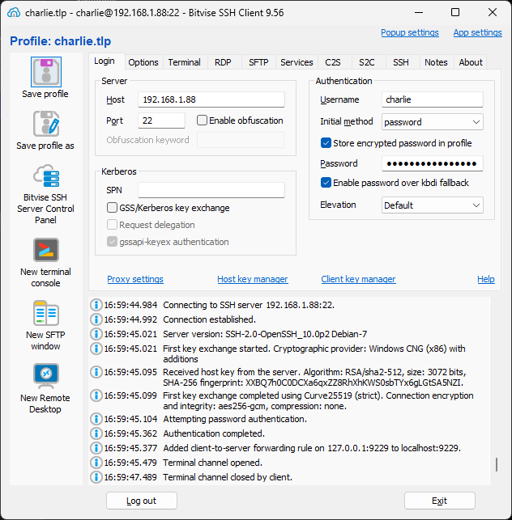
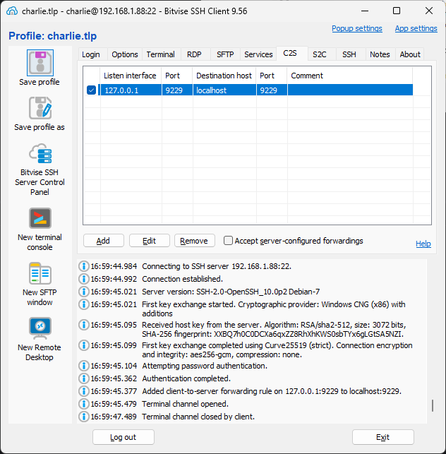

# WebStorm Setup (SFTP Auto-Sync + Remote Debugging)

This section describes how to configure WebStorm to edit files locally,
sync them to the Raspberry Pi, restart the app remotely, and attach a debugger.

---

## Prerequisites

- WebStorm installed locally
- SSH access to the Raspberry Pi as user `charlie`
- Repository cloned on the Pi at:

```text
/opt/charlie/charlie
```

---

## Configure SFTP Deployment

Open:

```text
Settings → Build, Execution, Deployment → Deployment
```

Add a new **SFTP** deployment.

### Connection

- Name: `charlie-pi`
- Host: `<PI_IP>`
- Port: `22`
- User: `charlie`
- Authentication: SSH key
- Root path: `/opt/charlie/charlie`

Test the connection.

---

### Mappings

- Local path: local Charlie repository
- Deployment path: `/opt/charlie/charlie`

---

### Excluded paths (important)

Exclude these from auto-upload:
```text
.git/
.yarn/
.pnp.cjs
.pnp.loader.mjs
.yarnrc.yml
yarn.lock
dist/
build/
coverage/
```

Allowed to sync:

```text
src/
config/
test/
package.json
```

---

### Enable automatic upload

In **Options**, enable:

```text
Automatic upload → Always
```

---

## SSH Tunnel for Debugging

### Option 1: Local Port Forwarding

Open a local terminal and run:

```shell
ssh -L 9229:127.0.0.1:9229 charlie@<PI_IP>
```

Keep this terminal open while debugging.

---


### Option 2: Use Bitvise SSH Client

#### Open Bitvise SSH Client:

* Host: `192.168.1.88`
* Username: `charlie`
* Authentication: SSH key or password
* Click **Log in** (verify normal SSH works first)




#### Create a new SSH Tunnel:

#### Go to **Services** → **Port Forwarding**

#### Add a C2S rule


| Field            | Value       |
|------------------|-------------|
| Type             | `C2S`       |
| Listen Interface | `127.0.0.1` |
| Listen Port      | `9229`      |
| Destination Host | `127.0.0.1` |
| Destination Port | `9229`      |




## WebStorm Debug Configuration

Create:

```text
Run → Edit Configurations → Attach to Node.js/Chrome
```

Set:

- Host: `localhost`
- Port: `9229`

---

## One-click Restart (External Tool)

Create a WebStorm **External Tool**:

- Name: `Restart Charlie (HW)`
- Program:

```text
ssh
```

- Arguments:

```text
charlie@<PI_IP> /opt/charlie/charlie/scripts/dev/restart.sh --mode hw
```

---

## Development Loop

1. Edit files locally
2. Files auto-sync via SFTP
3. Run the restart tool
4. Attach debugger
5. Debug normally

---

## Permission recovery

If permissions break:

```shell
sudo chown -R charlie:charlie /opt/charlie/charlie
```

---

## Result

Local editing, deterministic Pi runtime, safe remote debugging.
