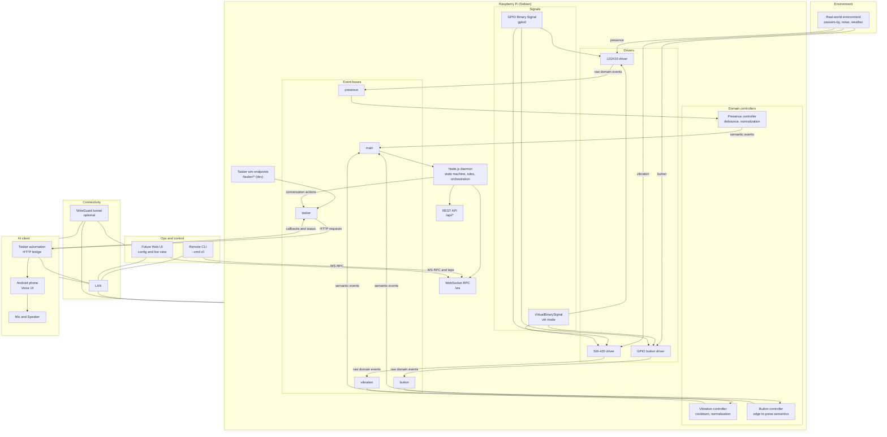

```mermaid
flowchart TB

subgraph ENV[Environment]
  Street["Real-world environment<br/>passers-by, noise, weather"]
end

subgraph RPI["Raspberry Pi (Debian)<br/>Charlie Runtime"]
  App["Node.js daemon<br/>state machine, rules, orchestration"]
  WS["WebSocket RPC<br/>/ws"]
  REST["REST API<br/>/api/*"]
  TaskerSim["Tasker sim endpoints<br/>/tasker/* (dev)"]

  subgraph BUSES[Event buses]
    PresenceBus[presence]
    VibrationBus[vibration]
    ButtonBus[button]
    TaskerBus[tasker]
    MainBus[main]
  end

  subgraph DOMAIN[Domain controllers]
    PresenceCtrl["Presence controller<br/>debounce, normalization"]
    VibrationCtrl["Vibration controller<br/>cooldown, normalization"]
    ButtonCtrl["Button controller<br/>edge to press semantics"]
  end

  subgraph DRIVERS[Drivers]
    Ld2410["LD2410 driver"]
    Sw420["SW-420 driver"]
    GpioBtn["GPIO button driver"]
  end

  subgraph SIGNALS[Signals]
    VirtSig["VirtualBinarySignal<br/>virt mode"]
    GpioSig["GPIO Binary Signal<br/>gpiod"]
  end
end

subgraph AI["AI client<br/>Android + Tasker"]
  Tasker["Tasker automation<br/>HTTP bridge"]
  Phone["Android phone<br/>Voice UI"]
  Audio["Mic and Speaker"]
end

subgraph NET[Connectivity]
  LAN[LAN]
  WG["WireGuard tunnel<br/>optional"]
end

subgraph OPS[Ops and control]
  CLI["Remote CLI<br/>--cmd cli"]
  WebUI["Future Web UI<br/>config and live view"]
end

Street -->|presence| Ld2410
Street -->|vibration| Sw420
Street -->|button| GpioBtn

VirtSig --> Ld2410
VirtSig --> Sw420
VirtSig --> GpioBtn

GpioSig --> Ld2410
GpioSig --> Sw420
GpioSig --> GpioBtn

Ld2410 -->|raw domain events| PresenceBus
Sw420 -->|raw domain events| VibrationBus
GpioBtn -->|raw domain events| ButtonBus

PresenceBus --> PresenceCtrl -->|semantic events| MainBus
VibrationBus --> VibrationCtrl -->|semantic events| MainBus
ButtonBus --> ButtonCtrl -->|semantic events| MainBus

MainBus --> App

App --> WS
App --> REST
TaskerSim --> TaskerBus

App -->|conversation actions| TaskerBus
TaskerBus -->|HTTP requests| Tasker
Tasker -->|callbacks and status| TaskerBus

Tasker --> Phone --> Audio

CLI -->|WS RPC| WS
WebUI -->|WS RPC and taps| WS

CLI --- LAN
WebUI --- LAN
Tasker --- LAN

LAN --- RPI
LAN --- AI

WG --- RPI
WG --- AI
WG --- OPS
```
